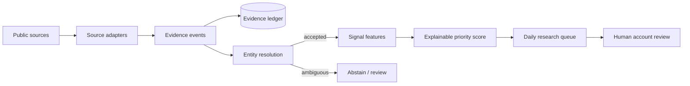

# CRE Foundry

**Evidence-first commercial real estate signal pipeline.** CRE Foundry turns public business and property events into a reviewable daily account-priority queue without pretending a heuristic score is a proven probability of sale.

> Local-first, deterministic, inspectable, and runnable offline with bundled fixtures. Optional live acquisition is isolated behind bounded source adapters.

## What this demonstrates

CRE Foundry is a compact proof of work in the parts of GTM intelligence systems that are easy to hand-wave and hard to implement well:

- ingesting messy public-source data behind explicit adapters;
- preserving provenance before commercial interpretation;
- resolving events to businesses while **abstaining on ambiguous identity**;
- deriving time-aware signals from accepted evidence only;
- ranking accounts with a transparent, decomposable score;
- producing a human-review queue with evidence briefs instead of hiding judgment in an opaque model.

## System



The practical question is simple: **which commercial accounts deserve a rep's attention today, and what evidence supports that decision?**

## Quickstart

```bash
python3 -m venv .venv
source .venv/bin/activate
pip install -e .
cre-foundry demo
```

Or run without installing:

```bash
PYTHONPATH=src python -m cre_foundry demo
```

Expected output is written to `outputs/demo/` as JSON, CSV, Markdown briefs, and a SQLite evidence ledger.

## Example queue

```text
#  Account                         Priority  Confidence  Top evidence
1  Northstar Logistics Inc.         82.9       0.95     recent expansion signal
2  Apex Food Processing Ltd.        74.4       0.95     current business record
3  Meridian Fabrication Corp.       56.7       0.90     older building permit
```

The fixture run processes **6 businesses, 7 evidence events, 5 accepted matches, 2 deliberate abstentions, 5 signals, and 3 ranked accounts**. Every ranked row remains traceable to the evidence used to create it.

Scores are **decision-support heuristics**, not conversion-probability claims.

## Why this architecture

- **Evidence before scoring.** Every signal carries source, timestamp, and raw-record identifiers.
- **Point-in-time discipline.** Future-known fields are excluded from historical feature construction.
- **Abstaining entity resolution.** Shared-address or weak matches are not silently forced.
- **Explainable ranking.** Score components are visible and deterministic.
- **Human review boundary.** The system generates a research queue; it does not authorize outreach.
- **Offline reproducibility.** Bundled fixtures produce the same outputs on every run.
- **Live-source isolation.** Public network acquisition is optional, bounded, and separated from core logic.

## Commands

```bash
cre-foundry doctor                     # environment + fixture checks
cre-foundry validate fixtures          # validate bundled source contracts
cre-foundry demo                       # full offline end-to-end run
cre-foundry score fixtures             # score bundled fixture inputs
cre-foundry fetch-brampton --limit 10  # optional live public-data sample
```

## Verified runs

The showcase has been verified locally on Apple Silicon / macOS with Python 3.12:

```text
Offline pipeline:  PASS
Tests:             7 passed
Python compile:    PASS
AI/prompt debris:  no common markers found
Live source:       10 City of Brampton permit events fetched successfully
```

See [`docs/VERIFICATION.md`](docs/VERIFICATION.md) for the reproducible verification record and a sample live-source run.

## Repository map

```text
src/cre_foundry/
  adapters.py          Source boundary + optional Brampton ArcGIS adapter
  entity_resolution.py Conservative account/event matching
  models.py            Typed domain contracts
  pipeline.py          End-to-end orchestration
  scoring.py           Transparent priority model
  signals.py           Evidence-to-signal derivation
  storage.py           SQLite evidence ledger
  briefs.py            Human-readable account briefs

fixtures/               Deterministic synthetic demo data
examples/               Checked-in offline + live-source examples
tests/                   Unit + end-to-end tests
docs/                    Architecture, methodology, verification
```

## Live data source

The optional adapter reads the **City of Brampton Building Permits ArcGIS service**. Acquisition is bounded by an explicit record limit and public-source attribution remains part of the adapter boundary. The deterministic fixture dataset is synthetic so the repository remains safe to run offline in an interview or code review.

## Priority model

The showcase score is deliberately transparent:

```text
score = 100 × (
  0.30 × recency
+ 0.25 × magnitude
+ 0.20 × corroboration
+ 0.15 × entity_confidence
+ 0.10 × signal_diversity
)
```

See [`docs/METHODOLOGY.md`](docs/METHODOLOGY.md) for definitions and the entity-resolution gate.

## Quality bar

```bash
python -m pytest
python -m compileall -q src tests
```

GitHub Actions runs the same checks against Python 3.11 and 3.12.

## Scope

CRE Foundry is a proof-of-work decision-support system, not a production brokerage system. It does not claim proven commercial lift, does not infer private facts, and does not automate prospect outreach.
