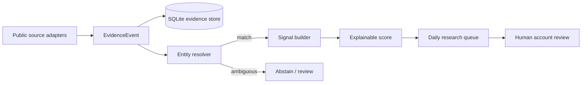

# Architecture

CRE Foundry intentionally separates **evidence**, **identity**, **signals**, and **decision support**.

## Boundaries

1. **Source adapters** only acquire and map source records.
2. **Evidence events** preserve provenance before any commercial interpretation.
3. **Entity resolution** is allowed to abstain; address equality alone does not always prove establishment identity.
4. **Signals** derive only from accepted evidence available as of the run date.
5. **Scoring** is deterministic and decomposable into named components.
6. **Output** is a research queue and evidence brief. Outreach remains a human decision.

## Why SQLite here

The showcase is designed to run offline in seconds with no services. SQLite is sufficient for the evidence ledger. A production analytical deployment can replace this boundary with DuckDB/Postgres without changing the domain contracts.
